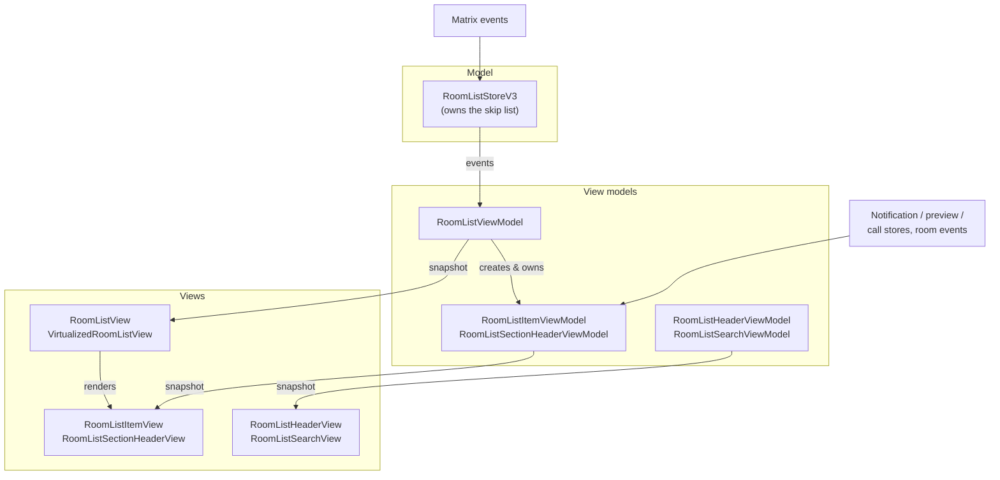

# Room list

The room list is the sorted, filtered list of rooms in the left-hand navigation panel, always
scoped to the active space. It is a full [MVVM](MVVM.md) feature split across three layers:

- **Model** — `RoomListStoreV3`, the store that keeps every room sorted and answers queries for
  the rooms in the active space. It lives in
  [`apps/web/src/stores/room-list-v3/`](https://github.com/element-hq/element-web/tree/develop/apps/web/src/stores/room-list-v3/).
- **View models** — adapt the store (and other stores) into snapshots for the UI. They live in
  [`apps/web/src/viewmodels/room-list/`](https://github.com/element-hq/element-web/tree/develop/apps/web/src/viewmodels/room-list/).
- **Views** — the presentational React components, owned by `@element-hq/web-shared-components`.

## Architecture

The key thing the diagram captures: view models subscribe to the **store**, never to the skip
list — the skip list is an internal detail of `RoomListStoreV3`. And the per-room and
per-section view models get their data from fine-grained domain stores directly, not from the
room-list store's update events.

## Model — the store

`RoomListStoreV3` (the "V3" is the third implementation) is a singleton exposed as
`RoomListStoreV3.instance`. Unlike the previous implementations, which re-computed lists on
demand, V3 keeps every room permanently sorted so retrieval is cheap.

**The skip list.** The core data structure is a
[skip list](https://en.wikipedia.org/wiki/Skip_list): stacked linked lists that make insertion
`O(log n)` on average. Rooms are wrapped in `RoomNode`s that cache whether the room is in the
active space and which filters it matches, so reading the list is just an ordered walk that
skips nodes outside the space or not matching the requested filters. When a room changes it is
re-inserted (re-sorted into place) and the rest of the list is untouched.

**Sorters.** A sorter defines the order of the list. There are three: **Alphabetic** (by room
name), **Recency** (most recent meaningful activity, with low-priority and muted rooms forced to
the bottom), and **Unread** (by unread importance). The user's choice is persisted and can be
changed at runtime, which rebuilds the list.

**Filters.** A filter answers a single yes/no question about a room, and each room's matching
filters are precomputed on its node. Filters serve two roles: **capability filters** back the
primary filter chips in the UI (Unread, People, Rooms, Favourites, Mentions, Invites, Low
Priority), and **section-tag filters** decide which section a room belongs to.

**Sections.** The store groups rooms into named sections (Favourites, Low Priority, Chats, and
user-created custom sections) using the section-tag filters described above. Sections are a topic
of their own — see [Sections](#sections) below.

**Spaces and updates.** The list is always scoped to the active space; rather than re-filter on
every read, each node caches its active-space membership and the store recomputes that flag when
the space changes. The store listens for the Matrix events that affect ordering or membership
(receipts, tag changes, account data, decryption, timeline events, membership) and responds by
re-inserting or removing the single affected room. Emissions to consumers are coalesced with
`requestAnimationFrame`, so a burst of updates within a frame collapses into one notification.

**Public surface.** This is the seam the view models bind to:

- Events: `ListsUpdate` (lists changed), `ListsLoaded` (initial load done), `SectionCreated`,
  and `RoomTagged` (a locally-initiated tag change, which drives the "chat moved" toast).
- `getSortedRoomsInActiveSpace(filterKeys?)` returns the sorted, filtered rooms grouped into
  sections. Narrower helpers exist too (DM rooms, server-notice rooms, the full sorted list).
- Section mutators (`createSection` / `editSection` / `removeSection` / `reorderSection`) and
  `resort`.

Note that **sticky-room behaviour lives in the view model, not the store** — the store itself is
unaware of a selected room.

## Sections

Sections are the named groups the room list displays. Membership is driven entirely by the Matrix
`m.tag` account data on each room, so moving a room between sections is just a matter of changing
its tags:

- **Favourites** and **Low Priority** use the default `m.favourite` and `m.lowpriority` tags and
  are pinned to the top and bottom of the list respectively.
- **Chats** is a synthetic catch-all section (tag `chats`) for every room that isn't in any other
  explicit section.
- **Custom sections** are user-created. Each is identified by a generated tag of the form
  `element.io.section.<uuid>`, and a room is placed in it by tagging the room with that tag.

The store keeps an ordered list of section tags — Favourites first, Low Priority last, and the
custom sections plus Chats reorderable in between (new custom sections are inserted just above
Chats by default). Custom sections can be created, renamed, removed, and reordered through
dialogs; that logic lives in [`section.ts`](https://github.com/element-hq/element-web/blob/develop/apps/web/src/stores/room-list-v3/section.ts).

Each custom section also records the space it was created in, which controls the visibility of
empty sections: an empty custom section is only shown in the space it belongs to, so sections
created in one space don't clutter unrelated spaces. Legacy sections without a stored space (or
whose space no longer exists) fall back to the Home meta-space.

### Flat list mode

When sectioning is turned off, the room list becomes a single flat list instead of a grouped one.
This is triggered in two places:

- If the `RoomList.showSections` setting is disabled, the store skips sectioning altogether and
  `getSortedRoomsInActiveSpace()` returns a single `chats` section containing every room in the
  active space.
- Even with sectioning enabled, `RoomListViewModel` treats the result as flat whenever the only
  section left is the Chats catch-all (`isFlatList`) — for example when the user has no favourite,
  low-priority, or custom-tagged rooms.

In flat mode the view renders a `FlatVirtualizedList` (no section headers); otherwise it renders a
`GroupedVirtualizedList` with headers and section drag-and-drop.

### Settings

Sections are configured entirely through settings:

- **`RoomList.showSections`** — whether sectioning is enabled at all. When off, the list is flat
  (see above).
- **`RoomList.CustomSectionData`** (account level) — the custom-section definitions, keyed by tag.
  Each entry stores the tag, the user-chosen name, and the space the section was created in.
  Malformed entries are dropped when the data is read.
- **`RoomList.OrderedCustomSections`** (account level) — the display order of the reorderable
  sections (the custom sections and Chats). Favourites and Low Priority are not stored here since
  they are always pinned to the top and bottom.
- **`RoomList.SectionExpansionState`** (device level) — the expanded/collapsed state of each
  section, stored per space and then per section tag. Sections default to expanded when no state
  has been persisted.

The account-level settings sync across a user's devices, while the expansion state is
device-local so that collapsing a section on one device doesn't affect the others.

## View models

The view models in [`apps/web/src/viewmodels/room-list/`](https://github.com/element-hq/element-web/tree/develop/apps/web/src/viewmodels/room-list/)
extend `BaseViewModel` and produce immutable snapshots consumed by the views (see [MVVM](MVVM.md)
for the base pattern).

**`RoomListViewModel`** is the root orchestrator and the **only** view model that subscribes to
the store's list events and calls `getSortedRoomsInActiveSpace()`. It builds the top-level
snapshot — whose sections carry only **room IDs**, not room objects — and owns the sticky-room
logic, the active filter, the "unread activity below the fold" toast, and section drag-and-drop.
It also lazily creates and owns the child view models.

**`RoomListItemViewModel`** (one per room) and **`RoomListSectionHeaderViewModel`** (one per
section) are created on demand by the root view model. Crucially, they do **not** listen to the
store's list events; instead they subscribe to fine-grained domain stores directly —
`RoomNotificationStateStore`, `MessagePreviewStore`, `CallStore`, room events, and settings — so
a single row can update independently of the rest of the list. The section header view model is
_fed_ its set of rooms imperatively by the parent and aggregates their notification state.

**`RoomListHeaderViewModel`** (the header bar: space title, sort menu, create actions) and
**`RoomListSearchViewModel`** (the search/dial/explore row) are decoupled siblings of the root
view model. They do not share state directly; the header view model receives things like the
collapse-all-sections state from the root view model through the global dispatcher.

Shared permission and create-room helpers used across these live in
[`utils.ts`](https://github.com/element-hq/element-web/blob/develop/apps/web/src/viewmodels/room-list/utils.ts).

## Views

The presentational components are owned by `@element-hq/web-shared-components` (developed in
Storybook); `apps/web` supplies the view models and a `renderAvatar` callback, and the shared
package owns all rendering. The app-side entry point is
[`RoomListPanel`](https://github.com/element-hq/element-web/blob/develop/apps/web/src/components/views/rooms/RoomListPanel/RoomListPanel.tsx), which
composes the search row, the header view, and the room list itself.

The room list proper is `RoomListView`, which delegates to `VirtualizedRoomListView` (built on
[`react-virtuoso`](https://virtuoso.dev/)). Virtualization is what drives the lazy lifecycle of
the child view models: as rows scroll into view the list calls back through
`getRoomItemViewModel(id)` and `getSectionHeaderViewModel(tag)` to obtain the view model for each
rendered room or header, and reports its visible range so off-screen item view models can be
disposed. Because each row binds to its own view model, it re-renders on its own data without
re-rendering the whole list.

The list renders either as a flat list or a grouped list with section headers, depending on the
`isFlatList` flag in the snapshot (see [Flat list mode](#flat-list-mode)); in the grouped case,
drag-and-drop is wired back to the root view model's `changeSectionOrder` and `changeRoomSection`
actions.
